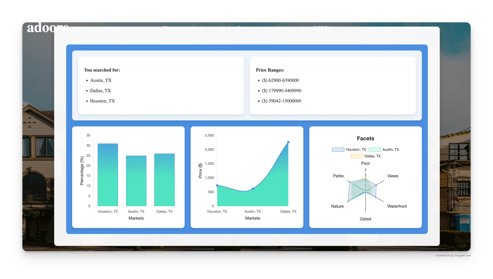

# Adoore - City Comparison Tool

**ZondaHome Internship Project**  
Adoore is a cross-country city comparison tool that provides housing insights using data from the BDX NewHomeSource Web API. It enables users, including home buyers and real estate professionals, to compare key metrics like price per square foot, quick move-in percentages, and community amenities.

## Features

- **Comprehensive Housing Insights**
  - Price per square foot
  - Quick move-in home availability
  - Community amenities analysis (Pools, Parks, Views, etc.)
- **Dynamic City Comparisons**
  - Compare multiple cities at once
  - Visualize key trends in real estate markets
- **Interactive Data Visualizations**
  - Chart.js used for intuitive bar charts, line graphs, and radar plots
- **Robust API Integration**
  - Fetches and processes real-time housing data
  - Uses BDX NewHomeSource Web API for accurate metrics
- **Optimized Front-End & Back-End**
  - Angular-based UI for interactive exploration
  - Java back-end for efficient data handling and API requests

## Technologies Used

- Angular & Typescript (for front-end development)
- Java (for back-end API processing)
- Chart.js (for data visualization)
- BDX NewHomeSource API (for real estate data)
- Jakarta EE (for efficient application support)

## Acknowledgements
Special thanks to **Bhimesh Kandibedala** for assisting me throughout development.
